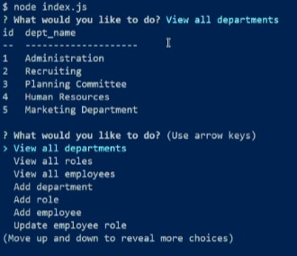

# Employee Tracker Tool

## Table of Contents

* [Description](#description)
* [Installation](#installation)
* [Usage](#usage)
* [Contributing](#contributing)
* [Questions](#questions)

## Description 

Employer Tracker Tool is a command-line application for a company database. This app uses the console.table package to print MySQL rows to the console, the Inquirer package to develop user prompts and user responses to interact with using a command line or integrated terminal in VS Code. The app also includes the MySQL2 package, which is used for connecting to a MySQL database.

### Demo Video

The walkthrough video demonstrates how a user would invoke the application from the command line. 

[Google Drive Video](https://drive.google.com/file/d/12HT5N3Y8WK_KtuBudgORUtQdmhwzj_Do/view)

### User Story
AS A business owner
I WANT to be able to view and manage the departments, roles, and employees in my company
SO THAT I can organize and plan my business

## Installation 

1. Clone the repo [here](https://github.com/ChristyGHanson/12-employee-tracker-tool).
2. Open the remote repo in Visual Studio Code.
3. Install Node.js by typing `npm i` in the VS Code integrated terminal.

## Usage 

1. Type `node index.js` to invoke the app from the command line in Visual Studio Code.
2. We see a list of choices appear. We can select any of these using the `up` and `down` arrow keys. Press `Enter` on the keyboard to select an option from the list or submit a typed answer. 

This is the complete list of 

* `View department`
* `View roles`
* `View employees`
* `Add department`
* `Add role`
* `Add employee`
* `Update employee role`
* `quit`

## Contributing 

Submit pull requests to the [repo](https://github.com/ChristyGHanson/12-employee-tracker-tool/pulls) here.

## Questions

Contact Christy Hanson via [email](mailto:chrsthnsn@gmail.com)

